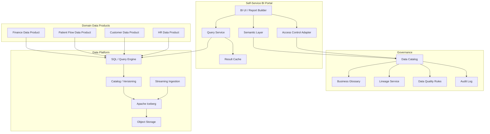

# C4 Component Diagram

Компонентный уровень для будущего портала самообслуживания и платформы данных.

## Роль компонентов

- `BI UI / Report Builder` — интерфейс аналитика и бизнес-пользователя.
- `Semantic Layer` — бизнесовые определения, метрики и безопасные срезы.
- `Access Control Adapter` — применение RBAC/ABAC-политик.
- `Data Catalog` — поиск, описание, lineage и ownership.
- `Query Engine + Iceberg + Object Storage` — вычисления и хранение аналитических наборов.
