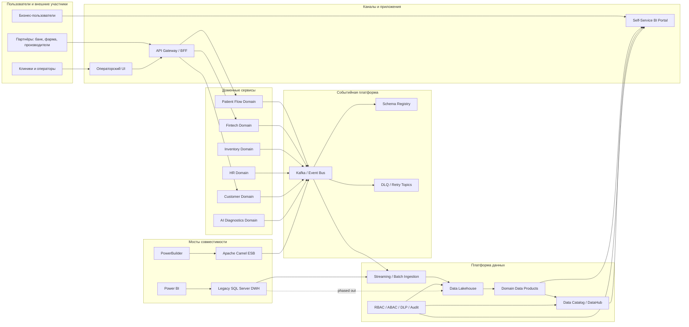

# C4 Container Diagram

Ниже показана целевая контейнерная архитектура "Будущего 2.0" на горизонте трёх лет.

## Архитектурная идея

- Операционные домены публикуют события и перестают зависеть от DWH как от точки интеграции.
- Data Lakehouse становится аналитическим слоем, а не местом для накопления бизнес-логики.
- Data Mesh задаёт доменное владение данными и self-service модель потребления.
- Camel и старый DWH остаются только как временные мосты совместимости.
