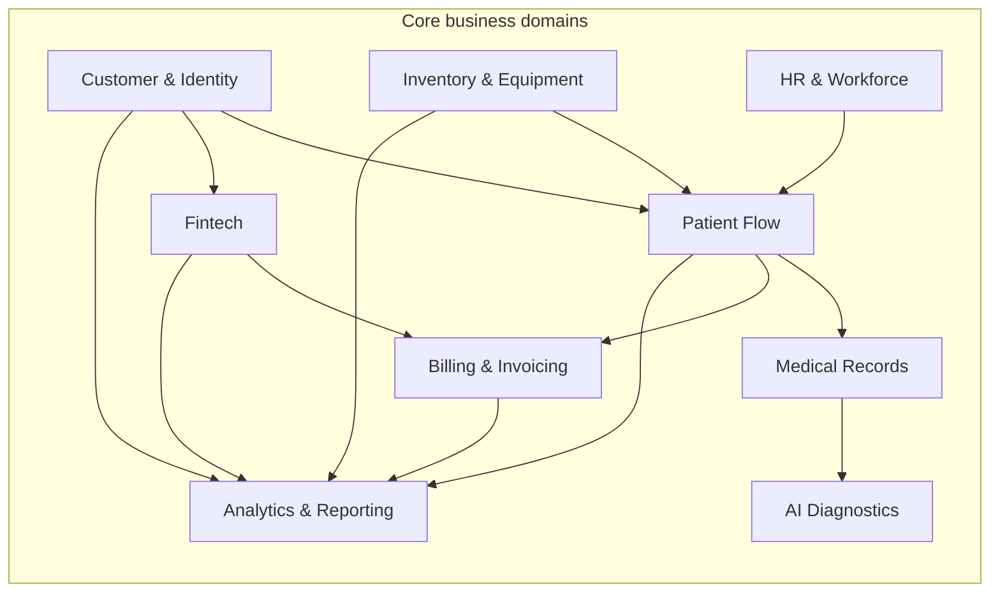

# Bounded Contexts

## Контексты

- `Customer & Identity` — единая идентификация клиента и его базовый профиль
- `Patient Flow` — запись, посещение, маршрутизация пациента, статусы обслуживания
- `Medical Records` — медицинские карты, истории болезней, результаты исследований
- `AI Diagnostics` — inference, результаты ИИ и объяснимость модели
- `Fintech` — кредиты, финансовые продукты, банковские операции
- `Billing & Invoicing` — счета, начисления, взаиморасчёты
- `Inventory & Equipment` — оборудование, запасы, инвентаризация
- `HR & Workforce` — персонал, расписание, компетенции
- `Analytics & Reporting` — доменные data products и self-service BI

## Границы

- `Medical Records` изолирован от BI-витрины: напрямую в self-service не попадает.
- `Analytics & Reporting` не владеет мастер-данными, а потребляет их по контрактам из доменов.
- `Fintech` и `Medical Records` имеют усиленные требования к безопасности и комплаенсу.
