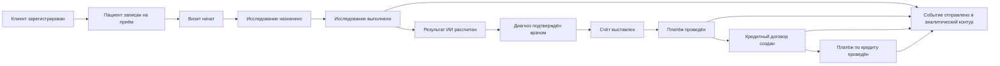

# Event Storming

## Источники и подписчики

| Событие | Источник | Подписчики |
|---|---|---|
| Клиент зарегистрирован | Customer & Identity | Patient Flow, Fintech, Analytics |
| Пациент записан на приём | Patient Flow | Billing, Inventory, Analytics |
| Исследование выполнено | Medical Records | AI Diagnostics, Analytics |
| Результат ИИ рассчитан | AI Diagnostics | Medical Records, Analytics |
| Счёт выставлен | Billing & Invoicing | Fintech, Analytics |
| Платёж проведён | Fintech / Billing | Analytics, CRM |
| Кредитный договор создан | Fintech | Analytics, CRM |
