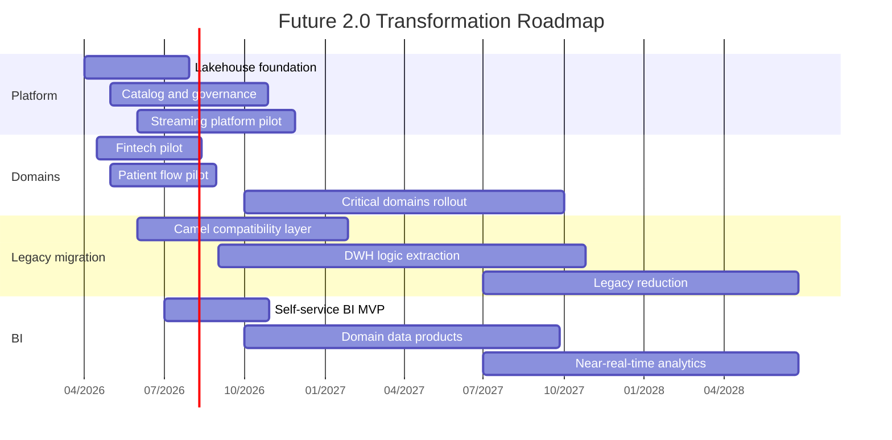

# Стратегический roadmap внедрения Data Mesh и новой платформы данных

## Роли

- `Chief Architect` — целевая архитектура, стандарты, архитектурный контроль
- `Data Product Owner` — владелец доменного data product
- `Data Engineer` — ingestion, contracts, качество данных, витрины
- `Platform Engineer` — Lakehouse, Kafka, каталог, observability
- `BI Analyst` — семантический слой и self-service сценарии
- `Security / Compliance` — классификация, доступы, аудит

## Этапы

### Этап 1. Пилот, 0-6 месяцев

- выбрать 1-2 пилотных домена: `Fintech`, `Patient Flow`
- развернуть базовую платформу: object storage, Iceberg, catalog, query engine
- ввести schema registry, DLQ, data contracts
- запустить пилотный self-service BI по не чувствительным данным
- подготовить ownership-модель и роли Data Product Owner

### Этап 2. Масштабирование, 6-18 месяцев

- подключить критичные домены и новые витрины
- внедрить Data Catalog и стандарты документации во всех пилотных доменах
- перевести часть интеграций с Camel/DWH на event-driven модель
- запустить потоковые витрины и near-real-time сценарии
- внедрить FinOps и продвинутую observability

### Этап 3. Консолидация, 18-36 месяцев

- сократить число синхронных интеграций на критическом пути
- вывести DWH из роли центра бизнес-логики
- оставить legacy только в изолированных контурах, если они ещё нужны
- перейти к доменной аналитике на потоках данных
- поддержать масштабирование по регионам и новым продуктам

## Связь с бизнес-целями

| Бизнес-цель | Инициатива в roadmap |
|---|---|
| Запуск новых финтех- и медицинских сервисов | Доменные data products и event-driven интеграции |
| Выход в новые регионы | Облачная платформа, стандартизированные контракты и governance |
| Рост объёма источников и событий | Lakehouse + streaming ingestion + catalog |
| Улучшение клиентского опыта и аналитики | Self-service BI и сокращение времени на отчётность |

## Визуальный план

